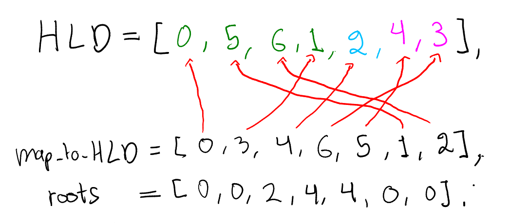
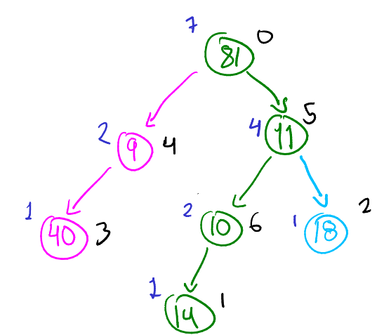
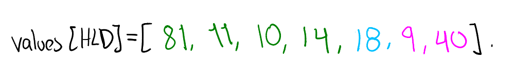
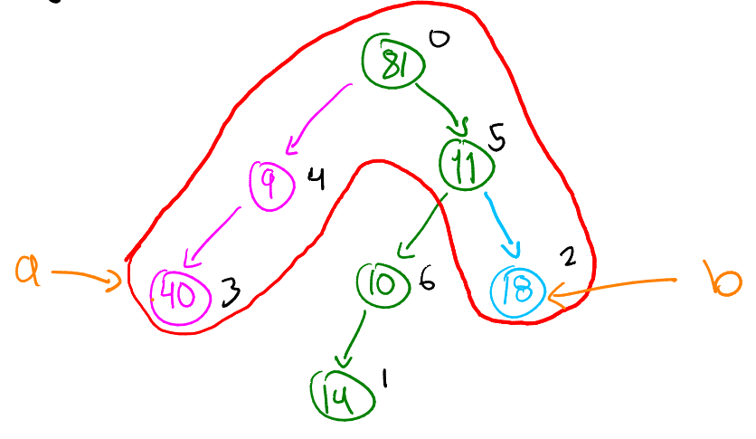
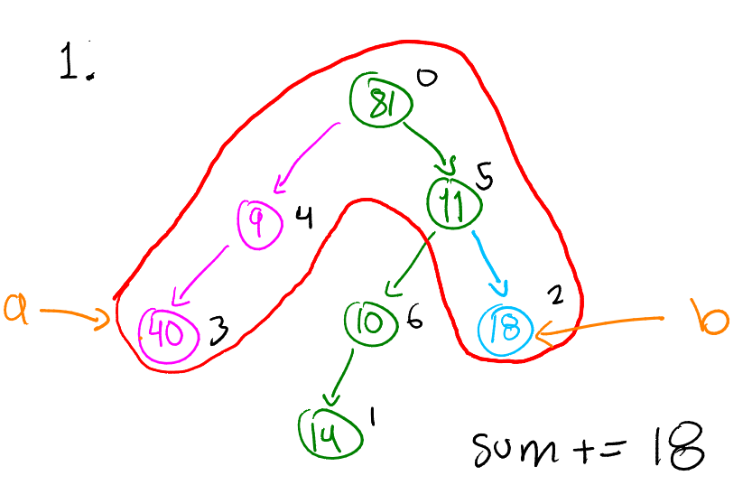
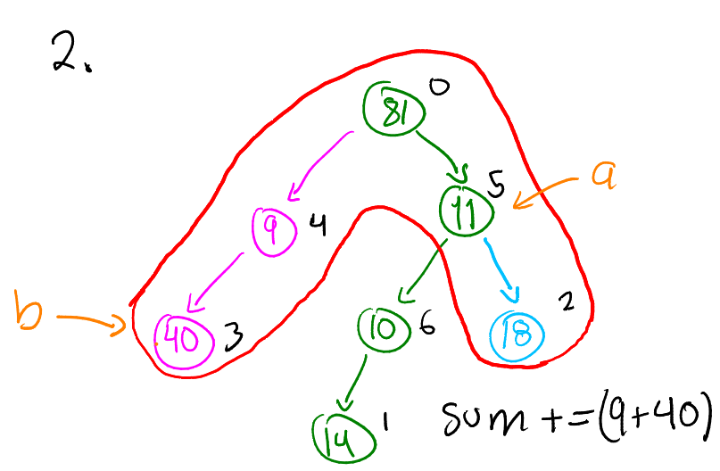
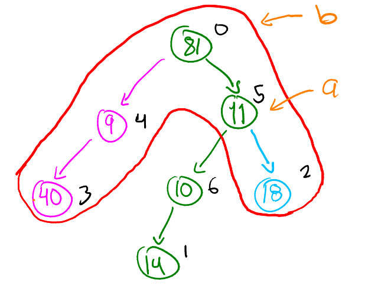
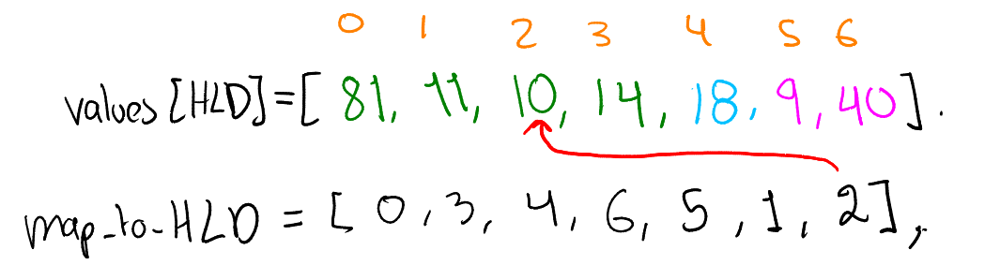

# HeavyLightDecomposition

Heavy Light Decomposition is a technique that allows to solve many problems related to queries on a tree. In this  repository we use this technique to compute the sum of the numbers on the simple path of two given nodes in the tree. Also we can update the values of nodes. The implementation consists on a single [C++ file](src/HLD.cpp).  

## Problem

We are given a (not necessarily binary) tree with nodes having an integer value inside. There are two types of queries:
- $P$: given two nodes $a$ and $b$, compute the sum of the values in each node in the unique simple path from $a$ to $b$. 
- $U$: Given a value $v$ and a node Id $n$ update the value of $n$ to $v$.  

### INPUT

First line contains two integers: $N$ the number of nodes and $Q$ the number of queries. Second line consists on $N$ integers, the values of each $i$-th node. The following $N-1$ lines contain the index of the parent of each $i$-th node. It is always assumed that node 0 is the root of the tree. The next $Q$ lines contain the queries. Each line begins with $P$ or $U$ characters. 

- For $P$ queries, two integers $a$ and $b$ are given separated by spaces. Integers $a$ and $b$ are nodes Ids for which the sum of its simple path shall be computed.
- For $U$ queries, two integers $n$ and $v$ are given separated by spaces. Node with Id $n$ shall be updated so it has value $v$. 

Throughout this explanation we will use next INPUT as an example 

```shell
7 2
81 14 18 40 9 11 10
6
5
4
0
0
5
P 3 2
U 6 5
```


This INPUT represents the following tree


where the number inside each node is the value (weight) and the number outside is the Id of the node. 

### OUTPUT

For each $P$ query print the sum of values in the simple path that links the two given nodes. Print a line break after each $P$ query.

In the input example we need to sum up values from node $3$ to node $2$. The simple path consists on nodes:
$$
3,  9, 0, 5, 2
$$
Adding up the values of this nodes we have the output 
$$
40 + 9 + 81 + 11 + 18 = 159.
$$
Therefore the OUTPUT of our INPUT example will be 
```shell
159

```


## Implementation

To save the tree, the implementation uses an adjacency list. For the example the adjacency list is the following. 

```shell
0 --> [4, 5]
1 --> []
2 --> []
3 --> []
4 --> [3]
5 --> [2, 6]
6 --> [1]
```

Recall that node 0 is always the root of the tree. 

### DFS (Depth First Search)

We first need to perform a DFS to store useful information. Specifically we will fill following vectors:
- depth : Depth of each node in the tree.
- parent: Parent of each node.
- heaviest: Heaviest child of the node. This is, the child with more descendants.

The parent of the root is defined to be -1 and the heaviest node of a leaf node is defined to be -1 as well. For our example we have:

```shell
depth = [0, 3, 2, 2, 1, 1, 2]
parent = [-1, 6, 5, 4, 0, 0, 5]
heaviest = [5, -1, -1, -1, 3, 6, 1]
```


In the following image we can see in blue the weight of each node. For instance, node 5 is heavier than node 4. That is why heaviest[0] = 5. 


### HLD (Heavy Light Decomposition)

The next step is to decompose the tree via HLD. We now construct another three vectors:

- HLD: It stores nodes Id's separated by paths. For instance, if the first path consists on $k$ nodes, the first $k$ places in the vector contain those $k$ nodes Id's in the order corresponding to the path beginning with the root of the path to the leaf node of the path. Then the vector stores another path in the same way and so on. 
- map_to_HLP: The $j$-th entry of this vector stores the index where node $j$ is in the HLD vector.
- roots: For each node, it stores the root of the path to which the node belongs. Recall that each of the nodes only belongs to one path.

The esencial information to perform the HLD is the vector "heaviest" computed before. With this vector one can know if a node $i$ will be the root of a path via the question:
```shell
heaviest[parent[i]] != i || parent[i] == -1
```
Recall that parent[i] == -1 tells you whether or not $i$ is the root of the entire tree. Question heaviest[parent[i]] != i tells you if $i$ is the heaviest node among it siblings. The function make_HLD constructs the vector HLD, map_to_HLD and roots.

In the example we are working with, the three vectors constructed by make_HLD are the following: 



We can see in HLD that there are three paths, each path is colored with different color. 

In the next image we color the tree in a way that each path has its own color as in the image above, the blue numbers are again the weights of each nodes (the same colors are used in the image above). Black numbers are the Id's of each nodes. 



It is worth mentioning that in order to choose which nodes form a path given a root of a path, we go down the via j = heaviest[j] until reaching a leaf node. 

### [Segment Three](https://www.geeksforgeeks.org/segment-tree-data-structure/)

After decomposing our tree we now construct the segment tree for the vector of the values of the nodes, sorted according to the vector HLD. This is, we construct a segment tree for vector whose entry $j$ es given by values[HLD[j]]. Recall that vector named values contains the integer inside each node. In this example:

```shell
values = [81, 14, 18, 40, 9, 11, 10]
```
The segment tree is constructed for the vector:




### Sum of a simple path

We want to answer query SumPath(a, b) where $a$ and $b$ are Id's of the two nodes. To answer this queries, the segment tree sum query is called $O(\lg N)$ times. In our INPUT  example $a=3$ and $b=2$. We desire to know the sum of the red path in the following image. 



While $a$ and $b$ are in distinct paths, the following steps are repeated:

- In $b$ we store the node whose path has the deeper root. If this is not respected we swap $a$ and $b$. 
- We add up to our variable $sum$ (that is initialized in 0) the output of the sum query of the segment tree of the interval [root[b], b]. Note that for every node $j$, root[j] will be always before than $j$ in the vector values[HLD]. 
- Update b = parent[root[b]].

In our example, the algorithm does the next:

1. The condition $b$ having the deeper root is respected. We add up to $sum$ the sum of the interval from node 2 to $b$ which is the same node 2. Now $b=5$


2. Perform swap(a, b). Update $sum$ adding up segment from node $4$ (which is the root of the path to which it belongs). to node $b=3$. Now $b=0$. 



3. Now both $a$ and $b$ are in the same path. 


Finally we add up to $sum$ the segment going from $a$ to $b$ via the segment tree sum query. We check before that $b$ is deeper than node $a$, if not they are swapped. In our example the algorithm does the following. 

4. We first swap $a$ and $b$. Sum up the segment from $a$ to $b$, i. e.  $sum$ += (81+11). Return $sum=159$.


### Updates

In order to update a node we simply update the segment tree. In this way, when receiving query Update(n, v) we just call function
```shell
update(map_to_HLD[n], v)
```
where "update" is the update function of the segment tree.

In our example we have query Update(6, 5). Recall that the segment tree corresponds to the vector:



The value of map_to_HLD[6] is the index that the segment tree will update. Therefore the query of the segment tree is called via update(2, 5). In the implementation we also update the vector "values". 

## Complexity

The implementation of the code uses a segment tree of an array of length $N$. When we aim to answer the query SumPath(a, b) we perform $O(\log N)$ segment tree queries. Recall that segment tree query has a $O(\log N)$ complexity. Therefore the queries of the sum of a simple path have a $O(\log^2 N)$ complexity. In the other hand to update a node, we only call the segment tree update query once which has a $O(\log N)$ complexity.