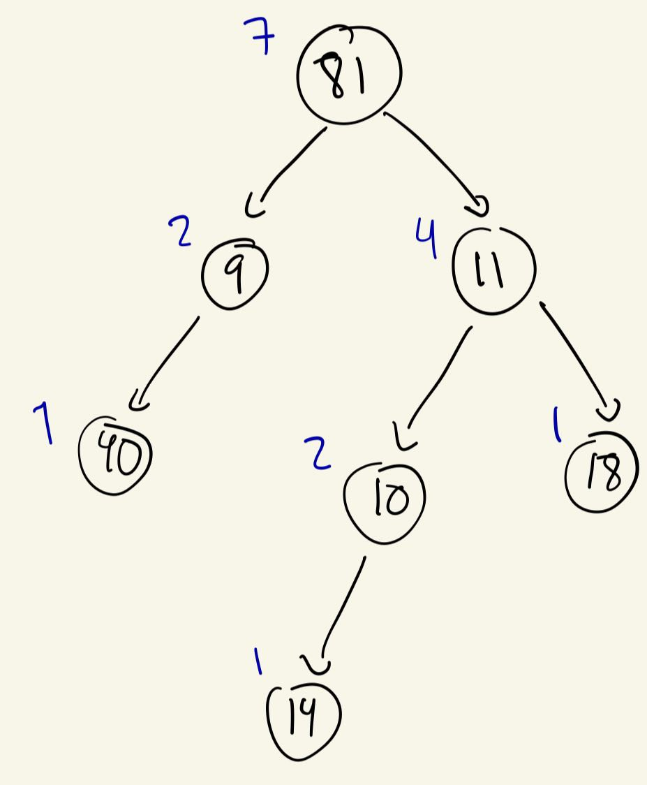

# HeavyLightDecomposition


## INPUT

First line contains two integers: $N$ the number of nodes and $Q$ the number of queries. In the second line consists on $N$ integers, the values of each $i$-th node. The following $N-1$ lines contain the index of the parent of each $i$-th node. It is assumed that node 0 is the root of the three. The next $Q$ lines contain the queries. There are two types of queries (TODO). 

Throughout this explanation we will use next INPUT as an example 

```shell
7 2
81 14 18 40 9 11 10
6
5
4
0
0
5
P 3 2
U 6 5
```


This INPUT represents the following three


where the number inside each node is the value (weight) and the number outside is the Id of the node. 

# Implementation

To save the three, the implementation uses an adjacency list. For the example the adjacency list is the following. 

```shell
0 --> [4, 5]
1 --> []
2 --> []
3 --> []
4 --> [3]
5 --> [2, 6]
6 --> [1]
```

Recall that node 0 is always the root of the three. 

### DFS (Depth First Search)

We first need to perform a DFS to store useful information. Specifically we will fill following vectors:
- depth : Depth of each node in the three.
- parent: Parent of each node.
- heaviest: Heaviest child of the node. This is, the child with more descendants.

The parent of the root is defined to be -1 and the heaviest node of a leaf node is defined to be -1 as well. For our example we have:

```shell
depth = [0, 3, 2, 2, 1, 1, 2]
parent = [-1, 6, 5, 4, 0, 0, 5]
heaviest = [5, -1, -1, -1, 3, 6, 1]
```


In the following image we can see in blue the weight of each node. For instance, node 5 is heavier thatn node 4. That is why heaviest[0] = 5. 


