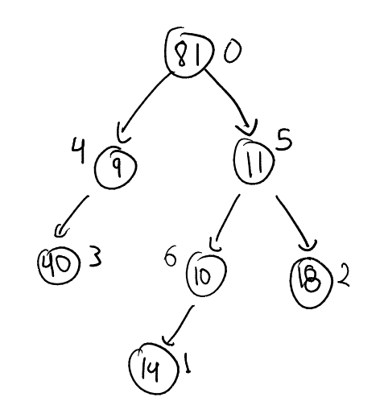

# HeavyLightDecomposition


## INPUT

First line contains two integers: $N$ the number of nodes and $Q$ the number of queries. In the second line consists on $N$ integers, the values of each $i$-th node. The following $N-1$ lines contain the index of the parent of each $i$-th node. It is assumed that node 0 is the root of the three. The next $Q$ lines contain the queries. There are two types of queries (TODO). 

Throughout this explanation we will use next INPUT as an example 

```shell
7 2
81 14 18 40 9 11 10
6
5
4
0
0
5
P 3 2
U 6 5
```

This INPUT represents the following three


